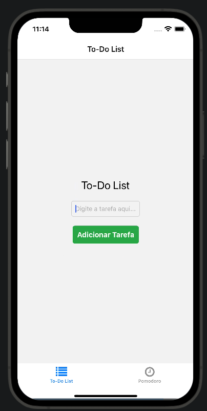

# Relatório Final

Nome: Raphael Garavati Erbert
RA: 22.123.014-7

# Introdução

Este relatório apresenta o desenvolvimento e os resultados do projeto realizado para a disciplina CCP4670. O projeto consiste na criação de um aplicativo em React Native, intitulado ProdBoost, que tem como objetivo ajudar os usuários a organizarem suas tarefas diárias de maneira eficiente. O aplicativo combina uma lista de tarefas (To-Do List) e uma ferramenta de produtividade baseada no método Pomodoro, amplamente recomendada por especialistas para aumentar o foco e evitar a fadiga.

# Motivação

A escolha pelo desenvolvimento do aplicativo ProdBoost surgiu da necessidade pessoal de organizar melhor as tarefas do dia a dia, garantindo maior eficiência e execução delas. Além disso, a inclusão do método Pomodoro foi motivada pela experiência positiva ao utilizá-lo no trabalho, onde intervalos regulares ajudam a manter o foco e prevenir o cansaço excessivo que ocorre ao realizar tarefas longas sem pausas.

# Objetivo

O objetivo principal deste projeto é desenvolver um aplicativo mobile funcional em React Native que permita aos usuários:

Criar e gerenciar uma lista de tarefas diária (To-Do List).
Utilizar um timer Pomodoro para organizar sessões de foco e descanso, maximizando a produtividade.
Além disso, o projeto busca:

- Desenvolver uma interface intuitiva e agradável ao usuário.

- Proporcionar um aplicativo funcional que una organização e produtividade.

- Explorar o uso de tecnologias modernas, como React Native e AsyncStorage, para gerenciar dados de forma eficiente.

# Funcionalidades

O aplicativo desenvolvido conta com as seguintes funcionalidades:

## 1. Tela de Login

- A tela de Login permite que usuários existentes acessem o aplicativo utilizando nome de usuário e senha. Ela valida as credenciais com base em dados armazenados localmente no dispositivo usando o AsyncStorage.

- Valida as credenciais armazenadas localmente usando o 'AsyncStorage' mostrando se o usuário inserido esta incorreto.

## 2. Tela de Cadastro

- A tela de Cadastro permite que novos usuários criem uma conta no aplicativo, registrando nome de usuário e senha no AsyncStorage.

- O usuário insere um nome de usuário e uma senha.

## 3. To-do List

- A To-Do List é uma funcionalidade de organização que permite aos usuários gerenciar suas tarefas diárias. Inclui opções para adicionar, concluir e excluir tarefas.

- Adicionar a tarefa por meio da criação de um id único com texto e estado de conclusão.

## 4. Pomodoro

- O Pomodoro ajuda os usuários a gerenciarem sessões de foco e descanso, baseado no método Pomodoro. Inclui tempos ajustáveis para foco e descanso, alternância automática entre os modos e vibração ao final de cada sessão.

- Contagem regressiva para saber quanto tempo falta para o usuário começar ou acabar o descanso (celular vibra para avisar o usuário)

- Personalização do tempo para que a pessoa possa ter maior controle do tempo de foco (necessário, pois cada pessoa tem seu tempo de foco pessoal)

# Conclusão

A partir do desenvolvimento deste projeto, foi possível alcançar os objetivos propostos, criando um aplicativo funcional e intuitivo. As principais conclusões incluem:

## 1. Objetivos Atingidos

- O aplicativo cumpriu seu propósito de combinar organização de tarefas e produtividade em uma única ferramenta.

## 2. Principais Desafios:

- Configuração inicial do ambiente de desenvolvimento para React Native

- Implementação e validação de funcionalidades com 'AsyncStorage'.

- Garantir a usabilidade e responsividade do aplicativo em diferentes dispositivos.

## 3. Aprendizados:

- Familiaridade com o framework React Native e suas bibliotecas.

- Melhora na lógica de implementação de navegação e manipulação de estados.

## 4. Possíveis Melhorias Futuras:

- Adicionar sincronização em nuvem para permitir o acesso às tarefas em diferentes dispositivos.

- Implementar notificações push para alertar os usuários ao término de sessões Pomodoro.

- Separação das tarefas por prioridades para melhor organização.

- Adicionar aba para calendário para salvar compromissos semanais.

- Melhorar a interface gráfica com animações e temas personalizáveis para melhor experiência do uruário.